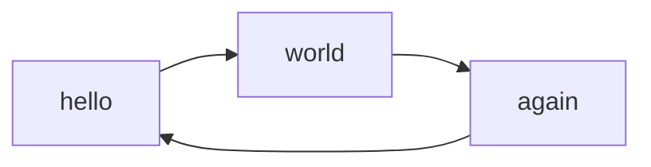

<div align="center">

# Mkdocs-Mermaid2


[](https://opensource.org/licenses/MIT) 
[](https://pypi.org/project/mkdocs-mermaid2-plugin/)


An [MkDocs](https://www.mkdocs.org/) plugin that renders [Mermaid](https://mermaid-js.github.io/mermaid) text descriptions into diagrams (flow charts, sequence diagrams, pie charts, etc.).

</div>

---

* **See the [mkdocs-mermaid2 documentation on Read The Docs](https://mkdocs-mermaid2.readthedocs.io).**
* See the [package on Pypi](https://pypi.org/project/mkdocs-mermaid2-plugin/).
* View the [general Mkdocs documentation](https://www.mkdocs.org/)


> As of version 1.0.0, this plugin works with versions of the Mermaid library > 10,
> **and** with lower versions.


<!-- To update the toc, run the following command:
markdown-toc -i README.md 
-->

<!-- toc -->

- [Mkdocs-Mermaid2](#mkdocs-mermaid2)
  - [Introduction](#introduction)
  - [Installation](#installation)
    - [Automatic](#automatic)
    - [Manual](#manual)
    - [Test](#test)
  - [Configuration](#configuration)
    - [Basic configuration](#basic-configuration)
    - [Specifying the version of the Mermaid library](#specifying-the-version-of-the-mermaid-library)
    - [Additional settings for the Material theme](#additional-settings-for-the-material-theme)
  - [For more information](#for-more-information)

<!-- tocstop -->

## Introduction

Mermaid2 allows you to insert mermaid markup in the markdown 
of your mkdocs pages.

For example, a markdown page containing the following diagram:

    ```mermaid
    graph LR
        hello --> world
        world --> again
        again --> hello
    ```

will then be displayed in the final HTML page as:



The diagram will be rendered on the fly by the web browser,
with the use of the mermaid javascript library. 
mkdocs-mermaid2 takes care of inserting the javascript library into
the html page.

> You can use all the diagrams types supported by the version of the Mermaid 
> javascript library that you are using (flowchart, class, state, timeline, 
> etc.).


## Installation

### Automatic


```bash
pip install mkdocs-mermaid2-plugin
```

### Manual
Clone this repository in a local directory and install the package:

```bash
python setup.py install
```

### Test
For running the examples the `test` directory, 
you will also need the mkdocs-material theme. You may 
[install it directly](https://squidfunk.github.io/mkdocs-material/getting-started/),
or use the following command to install the whole package:

```bash
pip install mkdocs-mermaid2-plugin[test]
```


## Configuration

### Basic configuration
To enable this plugin, you need to declare it in your [mkdocs config file](https://www.mkdocs.org/user-guide/configuration/)
(`mkdocs.yml`).

In order to work, the plugin also requires the
[mermaid](https://www.npmjs.com/package/mermaid) javascript
library (in the example below, it fetched from the last version
from the [unpkg](https://unpkg.com/) repository; change the version
no as needed).

```yaml
plugins:
    - search
    - mermaid2
```
> **Note:**  If you declare plugins, you need to declare _all_ of them, 
> including `search` (which would otherwise have been installed by default.)


### Specifying the version of the Mermaid library


By default, the plugin selects a version of the Mermaid javascript library
that is known to work (some versions work better than others).

You may specify a different version of the Mermaid library, like so:

```yaml
plugins:
  - search
  - mermaid2:
      version: 10.0.2
```

The plugin will insert the correct call to the javascript library
inside the final HTML page.

### Additional settings for the Material theme


> The [Material theme](https://squidfunk.github.io/mkdocs-material/), 
> developed by [squidfunk](https://github.com/squidfunk)
> is not mandatory, but recommended.

**Mermaid diagrams will automatically adapt their colors to the theme
and palette.**

Here are the _additional_ recommended settings in the configuration file:

```yaml
markdown_extensions:
  - pymdownx.superfences:
        # make exceptions to highlighting of code:
      custom_fences:
        - name: mermaid
          class: mermaid
          format: !!python/name:mermaid2.fence_mermaid_custom

```

> Do not use these additional settings for other themes, 
> as diagrams will probably **not** be displayed correctly. 


## For more information
See the [documentation on ReadTheDocs](https://mkdocs-mermaid2.readthedocs.io).