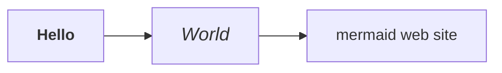
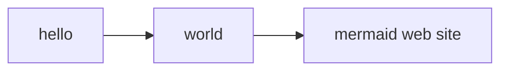
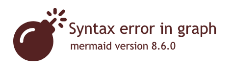

# mkdocs-mermaid2-plugin


[](https://opensource.org/licenses/MIT) 


An [MkDocs](https://www.mkdocs.org/) plugin that renders textual graph
descriptions into [Mermaid](https://mermaid-js.github.io/mermaid) graphs
(flow charts, sequence diagrams, pie charts, etc.).


> This is a fork from
> [Pugong Liu's excellent project](https://github.com/pugong/mkdocs-mermaid-plugin), 
> which is no longer maintained. It offers expanded documentation as
> well as new functions.


<!-- To update the toc, run the following command:
markdown-toc -i README.md 
-->

<!-- toc -->

- [How it works](#how-it-works)
- [Installation](#installation)
  * [Automatic](#automatic)
  * [Manual](#manual)
- [Configuration](#configuration)
  * [Basic configuration](#basic-configuration)
  * [Specifying the version of the Mermaid library](#specifying-the-version-of-the-mermaid-library)
  * [Explicit declaration of the Mermaid library](#explicit-declaration-of-the-mermaid-library)
- [Usage](#usage)
  * [General Principle](#general-principle)
  * [How to write Mermaid diagrams](#how-to-write-mermaid-diagrams)
  * [Adding arguments to the Mermaid engine](#adding-arguments-to-the-mermaid-engine)
  * [Testing](#testing)
  * [Adding a Javascript callback function](#adding-a-javascript-callback-function)
    + [Use Case](#use-case)
    + [Method](#method)
- [Tips and Tricks](#tips-and-tricks)
  * [Setting the security level to "loose"](#setting-the-security-level-to-loose)
  * [Formating text in diagrams](#formating-text-in-diagrams)
  * [Adding Hyperlinks to a Diagram (versions of Mermaid javascript >~ 8.5.0)](#adding-hyperlinks-to-a-diagram-versions-of-mermaid-javascript--850)
  * [Adding Hyperlinks to a Diagram (versions of Mermaid javascript <~ 8.5.0)](#adding-hyperlinks-to-a-diagram-versions-of-mermaid-javascript--850)
- [Compatibility](#compatibility)
  * [List](#list)
  * [Using Mermaid and code highlighting at the same time](#using-mermaid-and-code-highlighting-at-the-same-time)
    + [Usage](#usage-1)
    + [Use of markdown extensions](#use-of-markdown-extensions)
    + [Declaring the superfences extension](#declaring-the-superfences-extension)
- [Troubleshooting: the mermaid diagram is not being displayed](#troubleshooting-the-mermaid-diagram-is-not-being-displayed)
  * [Seeing an error message at the place of the diagram?](#seeing-an-error-message-at-the-place-of-the-diagram)
  * [The mermaid source code appears as-is (not read)?](#the-mermaid-source-code-appears-as-is-not-read)
  * [Using another theme than material ?](#using-another-theme-than-material-)
  * [Using superfences, but no diagram is displayed?](#using-superfences-but-no-diagram-is-displayed)
  * [Is mkdocs' version up to date (>= 1.1) ?](#is-mkdocs-version-up-to-date--11-)
  * [Is the javascript library properly called?](#is-the-javascript-library-properly-called)
  * [Rich text diagrams, or links are not displayed properly?](#rich-text-diagrams-or-links-are-not-displayed-properly)
  * [With pymdownx.details, diagrams in collapsed elements are not displayed?](#with-pymdownxdetails-diagrams-in-collapsed-elements-are-not-displayed)
- [Using the mermaid2.dumps() function](#using-the-mermaid2dumps-function)

<!-- tocstop -->

## How it works

**If you do not wish to learn the details under the hood,
skip to the [Installation](#installation) section**.

Normally mkdocs inserts the Mermaid code (text) describing the diagram 
into segments `<pre><code class='mermaid>`:

    <pre><div class="mermaid">
    ...
    <\pre><\div>

To make the HTML/css page more robust, the mermaid plugin converts 
those segments into `<div>` elements in the final HTML page:

    <div class="mermaid">
    ...
    <\div>

It also inserts a call to the 
[javascript library](https://github.com/mermaid-js/mermaid) :

    <script>
    mermaid.initialize(...)
    </script>

To interpret that code it inserts a call to the Mermaid library:
```javascript
<script src="https://unpkg.com/mermaid/dist/mermaid.min.js">
</script>
```

The user's browser will then read this code and render it on the fly.

> No svg/png images are harmed during the rendering of that graph.


## Installation

### Automatic


```bash
pip install mkdocs-mermaid2-plugin
```

### Manual
Clone this repository in a local directory and install the package:

```bash
python setup.py install
```

## Configuration

### Basic configuration
To enable this plugin, you need to declare it in your config file
(`mkdocs.yml`).

In order to work, the plugin also requires the
[mermaid](https://www.npmjs.com/package/mermaid) javascript
library (in the exemple below, it fetched from the last version
from the [unpkg](https://unpkg.com/) repository; change the version
no as needed).

```yaml
plugins:
    - search
    - mermaid2
```
> **Note:**  If you declare plugins, you need to declare _all_ of them, 
> including `search` (which would otherwise have been installed by default.)

> **Important:** If you use another theme than material you **must** use a version of the plugin >= 0.5.0.

### Specifying the version of the Mermaid library
> **For plugin version >= 0.4**

By default, the plugin selects a version of the Mermaid javascript library
that is known to work (some versions work better than others).

You may specify a different version of the Mermaid library, like so:

```yaml
plugins:
  - search
  - mermaid2:
      version: 8.6.4
```


### Explicit declaration of the Mermaid library
> If you use a version of the plugin >= 0.4, the basic steps are sufficient.

You _may_ specify the mermaid library explicitly, as long as it is
call mermaid (independently of extension):

```yaml
extra_javascript:
    - https://unpkg.com/mermaid@8.7.0/dist/mermaid.min.js
```

For the latest version:

```yaml
extra_javascript:
    - https://unpkg.com/mermaid/dist/mermaid.min.js
```


> **Note for plugin version < 0.4:** You **must*** include the mermaid.min.js (local or remotely) in your `mkdocs.yml`. If you want to be on the safe side, you may want to specify a version that you know is working for you, e.g. `https://unpkg.com/mermaid@8.7.0/dist/mermaid.min.js` 


## Usage

### General Principle
In order to insert a Mermaid diagram in a markdown page, simply 
type it using the mermaid syntax,
and surround it with the code fence for Mermaid:


    ```mermaid
    graph TD
    A[Client] --> B[Load Balancer]
    B --> C[Server01]
    B --> D[Server02]
    ```

### How to write Mermaid diagrams
* For instructions on how to make a diagram, see 
  [the official website](https://mermaid-js.github.io/mermaid/#/).
* If you are not familiar, see the [n00bs' introduction to mermaid](https://mermaid-js.github.io/mermaid/#/n00b-overview).
* In case of doubt, you will want to test your diagrams in the
  [Mermaid Live Editor](https://mermaid-js.github.io/mermaid-live-editor).


### Adding arguments to the Mermaid engine

By default, the plugin automatically inserts 
the a Javascript command `mermaid.initialize();`
in the HTML pages, which starts the interpretation.
Sometimes, however, you may want to add some
initialization commands (see [full list](https://github.com/knsv/mermaid/blob/master/docs/mermaidAPI.md#mermaidapi-configuration-defaults)).

For example, you could change the theme of the diagram, 
using 'dark' instead of the default one. 
Simply add those arguments in the config file, e.g.

```yaml
plugins:
    - search
    - mermaid2:
        arguments:
          theme: 'dark'


extra_javascript:
    - https://unpkg.com/mermaid/dist/mermaid.min.js
```

### Testing

To test your website with a diagram, restart the mkdocs server:

    mkdocs serve

In your browser, open the webpage on the localhost
(by default: `https://localhost:8000`)


### Adding a Javascript callback function

_New in 0.3.0_

#### Use Case
To make modifications that are not possible with css, it can be useful
to insert a callback function (Javascript) into the target HTML page.

This can be done using the standard pattern, e.g.:

```javascript
<script src="js/extra.js">
<script>mermaid.initialize({
    theme: "dark",
    mermaid: {
        callback: myMermaidCallbackFunction
    }
});</script>
```

In this case, `myMermaidCallbackFunction`is located in
the `js/extra.js` on the site's root directory. 

Here is a simplistic example:

```
// js/extra.js
function myMermaidCallbackFunction(id) {
  console.log('myMermaidCallbackFunction', id);
```

> You will see the results if you display the browser's console.

#### Method
This can be translated into the config (`mkdocs.yaml`) file as:

```yaml
plugins:
  - mermaid2:
      arguments:
        theme: dark
        mermaid:
            callback: ^myMermaidCallbackFunction

extra_javascript:
  - https://unpkg.com/mermaid/dist/mermaid.min.js
  - js/extra.js
```

1. Note that **the name of the function must be preceded by a ^ (caret)**
   to signify it's a literal and not a string.
2. Consider the **directory path** for the script
   as **relative to the document directory** (`docs`).
   Mkdocs will then put it in the proper place in the hierarchy of the
   html pages.

## Tips and Tricks

### Setting the security level to "loose"

To access these functions, you need to relax mermaid's security level,
([since version 8.2](https://mermaid-js.github.io/mermaid/#/?id=special-note-regarding-version-82)).

> This requires, of course, your application taking responsibility 
> for the security of the diagram source.

If that is OK with you, you can set the argument in the configuration of the
plugin:

```yaml
    - mermaid2:
        arguments:
          securityLevel: 'loose'
```

### Formating text in diagrams
> To enable this function, you need to [relax mermaid's security level to 'loose'](#setting-the-security-level-to-loose).

You may use HTML in the diagram.

> **Note:** This is guaranteed to work with Mermaid 8.6.4, but
> does not work e.g. on 8.7.0.




Use this in the config file:
```yaml
extra_javascript:
     - https://unpkg.com/mermaid@8.6.4/dist/mermaid.min.js
```


### Adding Hyperlinks to a Diagram (versions of Mermaid javascript >~ 8.5.0)

> To enable this function, you need to [relax mermaid's security level to 'loose'](#setting-the-security-level-to-loose).

Use the click directive in the language (for more information,
see [Interaction](https://mermaid-js.github.io/mermaid/#/flowchart?id=interaction) on the official mermaid website).




### Adding Hyperlinks to a Diagram (versions of Mermaid javascript <~ 8.5.0)
> To enable this function, you need to [relax mermaid's security level to 'loose'](#setting-the-security-level-to-loose).

It is possible to add hyperlinks to a  diagram, e.g.:

```
box1[An <b>important</b> <a href="http://google.com">link</a>] 
```


### Auto-configure dark mode based on Host OS

Using a combination of the literal (`^`) functionality of this plugin and the
[prefers-color-scheme](https://developer.mozilla.org/en-US/docs/Web/CSS/@media/prefers-color-scheme)
CSS media feature, one can have the plugin automatically enable dark mode.

```yaml
plugins:
  - search
  - mermaid2:
      arguments:
          theme: |
            ^(window.matchMedia && window.matchMedia('(prefers-color-scheme: dark)').matches) ? 'dark' : 'light'
```

This works well with the `scheme: preference` option in
[mkdocs-material](https://squidfunk.github.io/mkdocs-material/) and referenced in [their documentation](https://squidfunk.github.io/mkdocs-material/setup/changing-the-colors/#color-scheme).

## Compatibility

### List
Here is a short list of comptabilities and incompatibilities for
the mermaid plugin:

Item | Type | Status | Note 
--|--|--|--
**mkdocs** | theme | YES | (default) plugin version >= 0.5 | 
**material** | theme | YES |  |
**windmill** | theme | YES | plugin version >= 0.5 | 
**admonition** | extension | YES | 
**footnotes** | extension | YES | 
**minify** | plugin | NO | Breaks the mermaid diagrams.
**pymdownx.highlight** | extension | NO | Use [pymdownx.superfences](#declaring-the-superfences-extension)
**pymdownx.superfences** | extension | OK | [see paragraph](#declaring-the-superfences-extension)
**search** | plugin | OK | Do not forget to declare it in `config.yml`.


### Using Mermaid and code highlighting at the same time

#### Usage

It is quite natural that we want to display **mermaid diagrams**,
while having usual **code highlighting** (for bash, python, etc.).

#### Use of markdown extensions
**Symptom**: The mermaid code is not transformed into a diagram,
but processed as code to be displayed (colors, etc.).


The likely reason is that you have a markdown extension that interprets
all fenced code as code to display, and it prevents the mkdocs-mermaid2
plugin from doing its job.

**Do not use the [codehilite](https://squidfunk.github.io/mkdocs-material/extensions/codehilite/) markdown extension.**

Instead, use [facelessusers](https://github.com/facelessuser)'s splendid 
[PyMdown's superfences](https://facelessuser.github.io/pymdown-extensions/extensions/superfences/); and use the 
**[custom fences](https://facelessuser.github.io/pymdown-extensions/extensions/superfences/#custom-fences)**
facility.


#### Declaring the superfences extension
In the config file (`mkdocs.yaml`):

```yaml
markdown_extensions:
  - pymdownx.superfences:
      # make exceptions to highlighting of code:
      custom_fences:
        - name: mermaid
          class: mermaid
          format: !!python/name:mermaid2.fence_mermaid
```

It means: 

1. Take the fenced parts marked with mermaid
2. Turn them into `class='mermaid'`.
3. To format those pieces, use the function `fence_mermaid`, 
   from the mermaid2 package.


> **IMPORTANT:** Note that the superfences will be slightly more demanding with
> HTML tags inside a mermaid diagram: 
> **take care to always close the HTML tags that require it**
> (e.g. `<small>` must have its corresponding `</small>` tag).
> Otherwise, the extension system will attempt to close those tags 
> and it will break the diagram.


## Troubleshooting: the mermaid diagram is not being displayed

> To start with, use a simple diagram that you know is syntactically correct.

e.g.

    ```mermaid
    graph TD
    A[Client] --> B[Load Balancer]
    B --> C[Server01]
    B --> D[Server02]
    ```

### Seeing an error message at the place of the diagram?

In recent versions of the javascript library (> 8.6.0), a pretty
error message is displayed in case of incorrect syntax:



> **In earlier versions, the library displays nothing, which 
> can be confusing.**

If you see the error message, it is at least an indication that 
the mermaid javascript library was called.

### The mermaid source code appears as-is (not read)?
In that case, the javascript library was probably not called.
See the next questions.


### Using another theme than material ?

If the diagram is not rendered, upgrade to plugin version >= 0.5.0

### Using superfences, but no diagram is displayed?

If you are using the superfences extension, but you see the source
code, you probably forgot to declare the custom_fences. 
Se more explanations under [Declaring the superfences extension](#declaring-the-superfences-extension)

### Is mkdocs' version up to date (>= 1.1) ?

Use `mkdocs -v`.

If not, update it:

    pip install mkdocs --upgrade

Or, if you cloned this repo:

    python setup.py install


### Is the javascript library properly called?

> ***Note that that this is no longer mandatory since version 0.4 of the
> plugin.*** You may want to try to remove this call, in case there was
> an error.

In order to work, the proper javascript library must called from
the html page.

The configuration file (`mkdocs.yml`) should contain the following line:

    extra_javascript:
        - https://unpkg.com/mermaid/dist/mermaid.min.js


Every diagram should start with a valid preamble, e.g. `graph TD`.

In case of doubt, you may want to test your diagram in the
[Mermaid Live Editor](https://mermaid-js.github.io/mermaid-live-editor).


> Note, however, that the Mermaid Live Editor **does not
> support loose mode** (with HTML code in the mermaid code).

### Rich text diagrams, or links are not displayed properly?

1. As a first step, [set the security level to 'loose'](#setting-the-security-level-to-loose).
2. Make sure you use a compatible version of the javascript library
   (8.6.4, 8.8.0, ~~8.7.0~~). In principle, the version used
   by the plugin is compatible (see instructions to 
   [change the version](#specifying-the-version-of-the-mermaid-library)).


### With pymdownx.details, diagrams in collapsed elements are not displayed?

**This fix is experimental (it has been tested once and it worked).**

If you declared `pymdownx.details` in `config.yml` 
(under `markdown_extensions`), you may notice that a diagram will not
display correctly in that case:

```markdown
???- note "Collapsed"
    ```mermaid
    graph TD
    A[Client] --> B[Load Balancer]
    ```
    This is additional text.
```

Depending on the browser, you may have a dot, or nothing, etc.


In that case, use the following declaration in your `markdown_extensions`:
```yaml
  - pymdownx.superfences:
      # make exceptions to highlighting of code:
      custom_fences:
        - name: mermaid
          class: mermaid
          format: !!python/name:mermaid2.fence_mermaid_custom
```

The use of this function will trigger a custom behavior, with two effects:

1. It will create custom HTML tags, `<pre class='mermaid'><code>`.
2. It will deactivate the auto-load.

You **must** then use a special custom javascript loader for the diagram,
developed by [facelessuser](https://github.com/facelessuser): 

1. Copy the code from
the [website of PyMdown Extension](https://facelessuser.github.io/pymdown-extensions/extras/mermaid/#putting-it-all-together).
2. Paste it in a file in your project: `docs/js/loader.js`
3. Declare this script in the `config.yml` file:

```yaml
extra_javascript:
     - js/loader.js
```


## Using the mermaid2.dumps() function

As a bonus, mermaid2 exports the function `dumps()` which produces a string
describing a [JavaScript object](https://javascript.info/object).
It can be used to help generate JavaScript code from Python
(this is typically needed, when generating an HTML page that contains
JavaScript).

A JavaScript object is not exactly the same as a JSON object.
The reason why this why introduced is that sometimes one needs to produce
a key/value pair as:

```JavaScript
foo = MyFunctioName
```

where the value is _not_ a string but an identifier (in this case:
a function name).

Here is an example:

```python
import mermaid2

obj = { "hello": "world", 
    "barbaz": "^bazbar",
    "foo": {"bar": 2},
    "bar": True}

s = mermaid2.dumps(obj)

```

The purpose of the caret is to specify that the value should be
an identifier and not a string. The result will be:

```JavasScript
{
    hello: "world",
    barbaz: bazbar,
    foo: {
        bar: 2
    },
    bar: true
}
```
