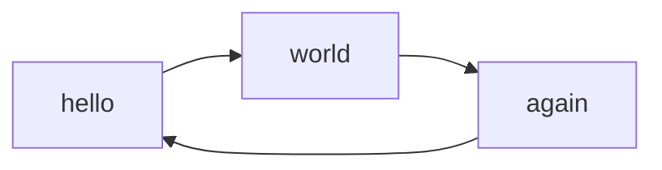
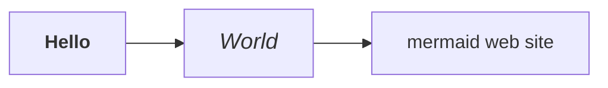
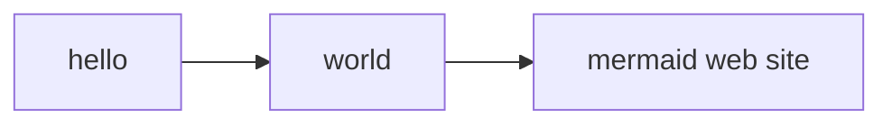

# mkdocs-mermaid2-plugin


**THIS IS AN OLD VERSION, KEPT HERE FOR REFERENCE**

[Use the documentation on ReadTheDocs](https://mkdocs-mermaid2.readthedocs.io).


[](https://opensource.org/licenses/MIT) 
[](https://pypi.org/project/mkdocs-mermaid2-plugin/)


An [MkDocs](https://www.mkdocs.org/) plugin that renders textual graph
descriptions into [Mermaid](https://mermaid-js.github.io/mermaid) graphs
(flow charts, sequence diagrams, pie charts, etc.).


> As of version 1.0.0, this plugin works with versions of the Mermaid library > 10,
> **and** with lower versions.


<!-- To update the toc, run the following command:
markdown-toc -i README.md 
-->

<!-- toc -->

- [Introduction](#introduction)
- [Installation](#installation)
  * [Automatic](#automatic)
  * [Manual](#manual)
  * [Test](#test)
- [How it works](#how-it-works)
- [Configuration](#configuration)
  * [Basic configuration](#basic-configuration)
  * [Specifying the version of the Mermaid library](#specifying-the-version-of-the-mermaid-library)
  * [Explicit declaration of the Mermaid library](#explicit-declaration-of-the-mermaid-library)
- [Usage](#usage)
  * [General Principle](#general-principle)
  * [How to write Mermaid diagrams](#how-to-write-mermaid-diagrams)
  * [Adding arguments to the Mermaid engine](#adding-arguments-to-the-mermaid-engine)
  * [Testing](#testing)
  * [Adding a Javascript callback function](#adding-a-javascript-callback-function)
    + [Use Case](#use-case)
    + [Method](#method)
- [Tips and Tricks](#tips-and-tricks)
  * [Setting the security level to "loose"](#setting-the-security-level-to-loose)
  * [Formatting text in diagrams](#formatting-text-in-diagrams)
  * [Adding Hyperlinks to a Diagram (versions of Mermaid javascript >~ 8.5.0)](#adding-hyperlinks-to-a-diagram-versions-of-mermaid-javascript--850)
  * [Adding Hyperlinks to a Diagram (versions of Mermaid javascript <~ 8.5.0)](#adding-hyperlinks-to-a-diagram-versions-of-mermaid-javascript--850)
  * [Auto-configure dark mode based on Host OS](#auto-configure-dark-mode-based-on-host-os)
  * [Material Theme: Switching the Mermaid diagram on the fly between light and dark mode](#material-theme-switching-the-mermaid-diagram-on-the-fly-between-light-and-dark-mode)
- [Compatibility](#compatibility)
  * [List](#list)
  * [Using Mermaid and code highlighting at the same time](#using-mermaid-and-code-highlighting-at-the-same-time)
    + [Usage](#usage-1)
    + [Use of markdown extensions](#use-of-markdown-extensions)
    + [Declaring the superfences extension](#declaring-the-superfences-extension)
- [Troubleshooting](#troubleshooting)
  * [The mermaid diagram is not displayed (or displayed incorrectly)](#the-mermaid-diagram-is-not-displayed-or-displayed-incorrectly)
    + [Seeing an error message at the place of the diagram?](#seeing-an-error-message-at-the-place-of-the-diagram)
    + [The mermaid source code appears as-is (not read)?](#the-mermaid-source-code-appears-as-is-not-read)
    + [Using another theme than material ?](#using-another-theme-than-material-)
    + [Using superfences, but no diagram is displayed?](#using-superfences-but-no-diagram-is-displayed)
    + [Is mkdocs' version up to date (>= 1.1) ?](#is-mkdocs-version-up-to-date--11-)
    + [Is the javascript library properly called?](#is-the-javascript-library-properly-called)
    + [A certain type of diagram (e.g. mindmap, etc.) is not displayed, or the syntax is incorrectly interpreted?](#a-certain-type-of-diagram-eg-mindmap-etc-is-not-displayed-or-the-syntax-is-incorrectly-interpreted)
  * [Other issues](#other-issues)
    + [Rich text diagrams, or links are not displayed properly?](#rich-text-diagrams-or-links-are-not-displayed-properly)
    + [With pymdownx.details, diagrams in collapsed elements are not displayed?](#with-pymdownxdetails-diagrams-in-collapsed-elements-are-not-displayed)
- [Using the mermaid2.dumps() function](#using-the-mermaid2dumps-function)
- [How to contribute](#how-to-contribute)
- [Credits](#credits)

<!-- tocstop -->

## Introduction

Mermaid2 allows you to insert mermaid markup in the markdown 
of your mkdocs pages.

For example, a markdown page containing the following diagram:

    ```mermaid
    graph LR
        hello --> world
        world --> again
        again --> hello
    ```

will then be displayed in the final HTML page as:



The diagram will be rendered on the fly by the web browser,
with the use of the mermaid javascript library. 
mkdocs-mermaid2 takes care of inserting the javascript library into
the html page.

> You can use all the diagrams types supported by the version of the Mermaid 
> javascript library that you are using (flowchart, class, state, timeline, 
> etc.).


## Installation

### Automatic


```bash
pip install mkdocs-mermaid2-plugin
```

### Manual
Clone this repository in a local directory and install the package:

```bash
python setup.py install
```

### Test
For running the examples the `test` directory, 
you will also need the mkdocs-material theme. You may 
[install it directly](https://squidfunk.github.io/mkdocs-material/getting-started/),
or use the following command to install the whole package:

```bash
pip install mkdocs-mermaid2-plugin[test]
```


## How it works

When converting the markdown into HTML, mkdocs normally inserts the
Mermaid code (text) describing the diagram 
into segments `<pre><code class='mermaid>`:

    <pre><div class="mermaid">
    ...
    </div></pre>

To make the HTML/css page more robust, the mermaid plugin converts 
those segments into `<div>` elements in the final HTML page:

    <div class="mermaid">
    ...
    </div>

It also inserts a call to the 
[javascript library](https://github.com/mermaid-js/mermaid) :


> **From version 1.0 of mkdocs-mermaid2:**

[For versions from 10.0.0 of the Mermaid javascript library, the plugin uses the ESM format](https://github.com/mermaid-js/mermaid/releases/tag/v10.0.0), since
it is the only one available. This requires a specific call from the HTML
page e.g.:
```html
<script type="module">
import mermaid from "https://unpkg.com/mermaid@10.0.2/dist/mermaid.esm.min.mjs"
</script>
```

For an earlier version of the library, the plugin uses the traditional call
from HTML:
```html
<script src="https://unpkg.com/mermaid@8.8.2/dist/mermaid.min.js">
</script>
```

To start displaying of the diagrams, the plugin then automatically inserts 
a separate call to initialize the Mermaid library:

    <script>
    mermaid.initialize()
    </script>


The user's browser will then read this code and render it on the fly.

> No svg/png images are produced during the rendering of that graph.


## Configuration

### Basic configuration
To enable this plugin, you need to declare it in your [mkdocs config file](https://www.mkdocs.org/user-guide/configuration/)
(`mkdocs.yml`).

In order to work, the plugin also requires the
[mermaid](https://www.npmjs.com/package/mermaid) javascript
library (in the example below, it fetched from the last version
from the [unpkg](https://unpkg.com/) repository; change the version
no as needed).

```yaml
plugins:
    - search
    - mermaid2
```
> **Note:**  If you declare plugins, you need to declare _all_ of them, 
> including `search` (which would otherwise have been installed by default.)

> **Important:** If you use another theme than material you **must** use a version of the plugin >= 0.5.0.

### Specifying the version of the Mermaid library
> **For plugin version >= 0.4**

By default, the plugin selects a version of the Mermaid javascript library
that is known to work (some versions work better than others).

You may specify a different version of the Mermaid library, like so:

```yaml
plugins:
  - search
  - mermaid2:
      version: 10.0.2
```

The plugin will insert the correct call to the javascript library
inside the final HTML page.


### Explicit declaration of the Mermaid library

You _may_ specify the mermaid library explicitly, as long as it is
call mermaid (independently of extension):

```yaml
extra_javascript:
    - https://unpkg.com/mermaid@8.7.0/dist/mermaid.min.js
```

This will be translated in the final HTML page as:

```html
<script src="https://unpkg.com/mermaid@8.7.0/dist/mermaid.min.js">
```

> This will work **only** for versions of the Mermaid javascript 
> library that can be called in that way, i.e. that do not use the ES Module
> standard (ESM). [Above version 10.0.0 only ESM format libraries are
> available](https://github.com/mermaid-js/mermaid/releases/tag/v10.0.0).


As a workaround you could declare a local script file:

```yaml
extra_javascript:
    - js/mermaidloader.js
```

Where `js` is a subdirectory of the document directory (`docs`).

If you are using a local javascript file, it is up to you to write the import,
with a version of the Mermaid library > 10 e.g.:

```javascript
import mermaid from "https://unpkg.com/mermaid@10.0.2/dist/mermaid.esm.min.mjs"
```

No explicit call to `mermaid.initialize()` is required, since it is
automatically inserted by the plugin.


## Usage

### General Principle
In order to insert a Mermaid diagram in a markdown page, simply 
type it using the mermaid syntax,
and surround it with the code fence for Mermaid:


    ```mermaid
    graph TD
    A[Client] --> B[Load Balancer]
    B --> C[Server01]
    B --> D[Server02]
    ```

### How to write Mermaid diagrams

* For instructions on how to make a diagram, see [the official website](https://mermaid.js.org).
* If you are not familiar, see the [Mermaid Overview for Beginners](https://mermaid.js.org/community/n00b-overview.html).
* In case of doubt, you will want to test your diagrams in the [Mermaid Live Editor](https://mermaid.live).

### Adding arguments to the Mermaid engine

By default, the plugin automatically inserts 
a Javascript command `mermaid.initialize();`
in the HTML pages, which starts the interpretation.
Sometimes, however, you may want to add some
initialization commands (see [full list](https://github.com/mermaid-js/mermaid/blob/master/docs/config/setup/modules/mermaidAPI.md#mermaidapi-configuration-defaults)).

For example, you could change the theme of the diagram, 
using 'dark' instead of the default one. 
Simply add those arguments in the config file, e.g.

```yaml
plugins:
    - search
    - mermaid2:
        arguments:
          theme: 'dark'
```

### Testing

To test your website with a diagram, restart the mkdocs server:

    mkdocs serve

In your browser, open the webpage on the localhost
(by default: `https://localhost:8000`)


### Adding a Javascript callback function

_New in 0.3.0_

**CAUTION**: As of the [version 10.0.0 of the javascript Library(https://github.com/mermaid-js/mermaid/blob/develop/CHANGELOG.md#changelog)], callbacks are no longer accepted.
If you wish to use callbacks, specify a lower version of the
library in the config file.

#### Use Case
To make modifications that are not possible with css, it can be useful
to insert a callback function (Javascript) into the target HTML page.

This can be done using the standard pattern, e.g.:

```javascript
<script src="js/extra.js">
<script>mermaid.initialize({
    theme: "dark",
    mermaid: {
        callback: myMermaidCallbackFunction
    }
});</script>
```

In this case, `myMermaidCallbackFunction`is located in
the `js/extra.js` on the site's root directory. 

Here is a simplistic example:

```
// js/extra.js
function myMermaidCallbackFunction(id) {
  console.log('myMermaidCallbackFunction', id);
```

> You will see the results if you display the browser's console.

#### Method
This can be translated into the config (`mkdocs.yaml`) file as:

```yaml
plugins:
  - mermaid2:
      arguments:
        theme: dark
        mermaid:
            callback: ^myMermaidCallbackFunction

extra_javascript:
  - https://unpkg.com/mermaid/dist/mermaid.min.js
  - js/extra.js
```

1. Note that **the name of the function must be preceded by a ^ (caret)**
   to signify it's a literal and not a string.
2. Consider the **directory path** for the script
   as **relative to the document directory** (`docs`).
   Mkdocs will then put it in the proper place in the hierarchy of the
   html pages.

## Tips and Tricks

### Setting the security level to "loose"

To access these functions, you need to relax mermaid's security level,
([since version 8.2](https://mermaid-js.github.io/mermaid/#/?id=special-note-regarding-version-82)).

> This requires, of course, your application taking responsibility 
> for the security of the diagram source.

If that is OK with you, you can set the argument in the configuration of the
plugin:

```yaml
    - mermaid2:
        arguments:
          securityLevel: 'loose'
```

### Formatting text in diagrams
> To enable this function, you need to [relax mermaid's security level to 'loose'](#setting-the-security-level-to-loose).

You may use HTML in the diagram.

> **Note:** This is guaranteed to work with Mermaid 8.6.4, but
> does not work e.g. on 8.7.0.




Use this in the config file:
```yaml
extra_javascript:
     - https://unpkg.com/mermaid@8.6.4/dist/mermaid.min.js
```


### Adding Hyperlinks to a Diagram (versions of Mermaid javascript >~ 8.5.0)

> To enable this function, you need to [relax mermaid's security level to 'loose'](#setting-the-security-level-to-loose).

Use the click directive in the language (for more information,
see [Interaction](https://mermaid-js.github.io/mermaid/#/flowchart?id=interaction) on the official mermaid website).




### Adding Hyperlinks to a Diagram (versions of Mermaid javascript <~ 8.5.0)
> To enable this function, you need to [relax mermaid's security level to 'loose'](#setting-the-security-level-to-loose).

It is possible to add hyperlinks to a  diagram, e.g.:

```
box1[An <b>important</b> <a href="https://google.com">link</a>] 
```


### Auto-configure dark mode based on Host OS

Using a combination of the unquote (`^`) functionality of this plugin and the
[prefers-color-scheme](https://developer.mozilla.org/en-US/docs/Web/CSS/@media/prefers-color-scheme)
CSS media feature, one can have the plugin automatically enable dark mode.

```yaml
plugins:
  - search
  - mermaid2:
      arguments:
          theme: |
            ^(window.matchMedia && window.matchMedia('(prefers-color-scheme: dark)').matches) ? 'dark' : 'light'
```

This works well with the `scheme: preference` option in
[mkdocs-material](https://squidfunk.github.io/mkdocs-material/) and referenced in [their documentation](https://squidfunk.github.io/mkdocs-material/setup/changing-the-colors/#color-scheme).


### Material Theme: Switching the Mermaid diagram on the fly between light and dark mode
The Material theme for MkDocs allows [toggling between colors](https://squidfunk.github.io/mkdocs-material/setup/changing-the-colors/#color-palette-toggle).
Unfortunately the Mermaid diagram will not switch out of the box from light to
dark or vice versa. 


This solution is similar to [switch the theme according to the OS color](#auto-configure-dark-mode-based-on-host-os), 
though that earlier, simpler solution cannot toggle dynamically.

A workable solution has been proposed by [elgalu](https://github.com/elgalu)
(for more information see [Issue 39](https://github.com/fralau/mkdocs-mermaid2-plugin/issues/39)).


**`mkdocs.yml`**

(The palette is an example, where primary color, accent, icons, toggle message, etc. can be adapted to your needs.)

```yaml
theme:
  name: material
  # https://squidfunk.github.io/mkdocs-material/setup/changing-the-colors/#color-palette
  palette:
    - media: "(prefers-color-scheme: light)"
      scheme: default
      primary: indigo
      accent: light-blue
      toggle:
        icon: material/toggle-switch-off-outline
        name: Switch to dark mode
    - media: "(prefers-color-scheme: dark)"
      scheme: slate
      primary: black
      accent: deep orange
      toggle:
        icon: material/toggle-switch
        name: Switch to light mode

  # https://facelessuser.github.io/pymdown-extensions/extensions/superfences/
  pymdownx.superfences:
      custom_fences:
        - name: mermaid
          class: mermaid
          format: !!python/name:mermaid2.fence_mermaid

plugins:
  - mermaid2:
      arguments:
        # test if its __palette_1 (dark) or __palette_2 (light)
        # for mkdocs-material >=8.0.0
        theme: |
          ^(JSON.parse(__md_get("__palette").index == 1)) ? 'dark' : 'light'
#       for mkdocs-material <8.0.0
#         ^(JSON.parse(window.localStorage.getItem(__prefix('__palette'))).index == 1) ? 'dark' : 'light'

extra_javascript:
    - extra/refresh_on_toggle_dark_light.js
```

> The caret operator (`^`) means "unquote". It is used here to insert Javascript code into the initialization code of `mermaid.initialize()`.


**`docs/extra/refresh_on_toggle_dark_light.js`**

To avoid refreshing the page after switching between dark/light modes so that Mermaid diagram can be updated, two listeners
must be installed, which are instructed to reload the page, whenever 
they detect a change.

That is the function of the additional script
(`refresh_on_toggle_dark_light.js`):

```javascript
var paletteSwitcher1 = document.getElementById("__palette_1");
var paletteSwitcher2 = document.getElementById("__palette_2");

paletteSwitcher1.addEventListener("change", function () {
  location.reload();
});

paletteSwitcher2.addEventListener("change", function () {
  location.reload();
});
```

## Compatibility

### List
Here is a short list of compatibilities and incompatibilities for
the mermaid plugin:

| Item                     | Type      | Status | Note                                                             |
|--------------------------|-----------|--------|------------------------------------------------------------------|
| **mkdocs**               | theme     | YES    | (default) plugin version >= 0.5                                  | 
| **material**             | theme     | YES    |                                                                  |
| **windmill**             | theme     | YES    | plugin version >= 0.5                                            | 
| **admonition**           | extension | YES    |                                                                  |
| **footnotes**            | extension | YES    |                                                                  |
| **minify**               | plugin    | NO     | Breaks the mermaid diagrams.                                     |
| **pymdownx.highlight**   | extension | NO     | Use [pymdownx.superfences](#declaring-the-superfences-extension) |
| **pymdownx.superfences** | extension | OK     | [see paragraph](#declaring-the-superfences-extension)            |
| **search**               | plugin    | OK     | Do not forget to declare it in `config.yml`.                     |

### Using Mermaid and code highlighting at the same time

>**IMPORTANT** Do NOT use Superfences unless you want code highlighting.

#### Usage

It is quite natural that we want to display **mermaid diagrams**,
while having usual **code highlighting** (for bash, python, etc.).

#### Use of markdown extensions
**Symptom**: The mermaid code is not transformed into a diagram,
but processed as code to be displayed (colors, etc.).


The likely reason is that you have a markdown extension that interprets
all fenced code as code to display, and it prevents the mkdocs-mermaid2
plugin from doing its job.

**Do not use the [codehilite](https://squidfunk.github.io/mkdocs-material/extensions/codehilite/) markdown extension.**

Instead, use [facelessusers](https://github.com/facelessuser)'s splendid 
[PyMdown's superfences](https://facelessuser.github.io/pymdown-extensions/extensions/superfences/); and use the 
**[custom fences](https://facelessuser.github.io/pymdown-extensions/extensions/superfences/#custom-fences)**
facility.


#### Declaring the superfences extension
In the config file (`mkdocs.yaml`):

```yaml
markdown_extensions:
  - pymdownx.superfences:
      # make exceptions to highlighting of code:
      custom_fences:
        - name: mermaid
          class: mermaid
          format: !!python/name:mermaid2.fence_mermaid
```

It means: 

1. Take the fenced parts marked with mermaid
2. Turn them into `class='mermaid'`.
3. To format those pieces, use the function `fence_mermaid`, 
   from the mermaid2 package.

There are **two** functions:

* `fence_mermaid` for the general case.
* `fence_mermaid_custom` for the Material theme (note the use of
the **custom** suffix)

Hence, for the Material theme (only):
```yaml
markdown_extensions:
  - pymdownx.superfences:
      # make exceptions to highlighting of code:
      custom_fences:
        - name: mermaid
          class: mermaid
          format: !!python/name:mermaid2.fence_mermaid_custom
```


> **IMPORTANT:** Note that the superfences will be slightly more demanding with
> HTML tags inside a mermaid diagram: 
> **take care to always close the HTML tags that require it**
> (e.g. `<small>` must have its corresponding `</small>` tag).
> Otherwise, the extension system will attempt to close those tags 
> and it will break the diagram.


## Troubleshooting

### The mermaid diagram is not displayed (or displayed incorrectly)

> To start with, use a simple diagram that you know is syntactically correct.

e.g.

    ```mermaid
    graph TD
    A[Client] --> B[Load Balancer]
    B --> C[Server01]
    B --> D[Server02]
    ```

#### Seeing an error message at the place of the diagram?

In recent versions of the javascript library (> 8.6.0), a pretty
error message is displayed in case of incorrect syntax:


> **In earlier versions, the library displays nothing, which 
> can be confusing.**

If you see the error message, it is at least an indication that 
the mermaid javascript library was called.

#### The mermaid source code appears as-is (not read)?
In that case, the javascript library was probably not called.
See the next questions.


#### Using superfences, but no diagram is displayed?

If you are using the superfences extension, but you see the source
code, you probably forgot to declare the custom_fences. 
Se more explanations under [Declaring the superfences extension](#declaring-the-superfences-extension)

#### Is mkdocs' version up to date (>= 1.1) ?

Use `mkdocs -v`.

If not, update it:

    pip install mkdocs --upgrade

Or, if you cloned this repo:

    python setup.py install


#### Is the javascript library properly called?

In order to work, the proper javascript library must called from
the html page (this is done automatically).
If necessary check the link used in the HTML page generated, e.g.:

```HTML
<script type="module">import mermaid from "https://unpkg.com/mermaid@10.0.2/dist/mermaid.esm.min.mjs"</script>
```

Every diagram should start with a valid preamble, e.g. `graph TD`.

In case of doubt, you may want to test your diagram in the
[Mermaid Live Editor](https://mermaid-js.github.io/mermaid-live-editor).


> Note, however, that the Mermaid Live Editor **does not
> support loose mode** (with HTML code in the mermaid code).

#### A certain type of diagram (e.g. mindmap, etc.) is not displayed, or the syntax is incorrectly interpreted?

Check the version of the javascript mermaid library you are using (it's indicated
in the error message; as a last resort, check in the html page). 
You can [change the library version if needed](#specifying-the-version-of-the-mermaid-library).

### Other issues

#### Rich text diagrams, or links are not displayed properly?

1. As a first step, [set the security level to 'loose'](#setting-the-security-level-to-loose).
2. Make sure you use a compatible version of the javascript library
   (8.6.4, 8.8.0, ~~8.7.0~~). In principle, the version used
   by the plugin is compatible (see instructions to 
   [change the version](#specifying-the-version-of-the-mermaid-library)).


#### With pymdownx.details, diagrams in collapsed elements are not displayed?

**This fix is experimental (it has been tested once and it worked).**

If you declared `pymdownx.details` in `config.yml` 
(under `markdown_extensions`), you may notice that a diagram will not
display correctly in that case:

```markdown
???- note "Collapsed"
    ```mermaid
    graph TD
    A[Client] --> B[Load Balancer]
    ```
    This is additional text.
```

Depending on the browser, you may have a dot, or nothing, etc.


In that case, use the following declaration in your `markdown_extensions`:
```yaml
  - pymdownx.superfences:
      # make exceptions to highlighting of code:
      custom_fences:
        - name: mermaid
          class: mermaid
          format: !!python/name:mermaid2.fence_mermaid_custom
```

The use of this function will trigger a custom behavior, with two effects:

1. It will create custom HTML tags, `<pre class='mermaid'><code>`.
2. It will deactivate the auto-load.

You **must** then use a special custom javascript loader for the diagram,
developed by [facelessuser](https://github.com/facelessuser): 

1. Copy the code from
the [website of PyMdown Extension](https://facelessuser.github.io/pymdown-extensions/extras/mermaid/#putting-it-all-together).
2. Paste it in a file in your project: `docs/js/loader.js`
3. Declare this script in the `config.yml` file:

```yaml
extra_javascript:
     - js/loader.js
```


## Using the mermaid2.dumps() function

As a bonus, mermaid2 exports the function `dumps()` which produces a string
describing a [JavaScript object](https://javascript.info/object).
It can be used to help generate JavaScript code from Python
(this is typically needed, when generating an HTML page that contains
JavaScript).

A JavaScript object is not exactly the same as a JSON object.
The reason why this why introduced is that sometimes one needs to produce
a key/value pair as:

```JavaScript
foo = MyFunctioName
```

where the value is _not_ a string but an identifier (in this case:
a function name).

Here is an example:

```python
import mermaid2

obj = { "hello": "world", 
    "barbaz": "^bazbar",
    "foo": {"bar": 2},
    "bar": True}

s = mermaid2.dumps(obj)

```

The purpose of the caret is to specify that the value should be
an identifier and not a string. The result will be:

```JavasScript
{
    hello: "world",
    barbaz: bazbar,
    foo: {
        bar: 2
    },
    bar: true
}
```

## How to contribute

Contributions are welcome.

Use the Issues to signal a bug or propose a feature you believe is necessary.

If this is a usage question, prefer the discussions.

Always open an Issue and consider the answers, before submitting a PR.

## Credits

mkdocs-mermaid2 is a fork from
[Pugong Liu's excellent project](https://github.com/pugong/mkdocs-mermaid-plugin), 
which is no longer maintained. This new plugin offers expanded documentation as
well as new functions.

It is also compatible with versions of the mermaid library > 10.0.

Thanks to all the members of the community who participated to the 
improvement of this project with ideas and PRs.