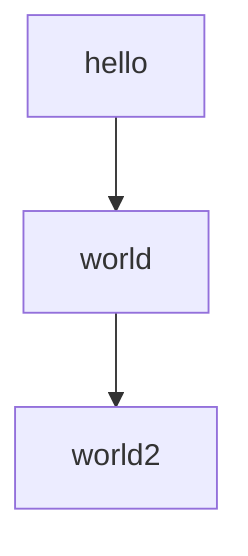
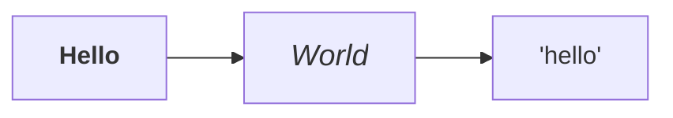

# Mermaid test

## Mermaid (normal)
This is a test of Mermaid:



> If you don't see a graph here, it's broken.

## Mermaid (with HTML)

This code exploits the 'loose' security level.

> If you don't see a graph here, it's broken.
> **Hello** should be bold, and *World* should be big and italic.
>
> If you see the tags `<b>` or `<i>`, it's broken.



## Superfence
This is usual superfenced code, with code highlighting.

> The keyword `for` should be colored in blue.

```python
for page in pages:
    page.read()
```

