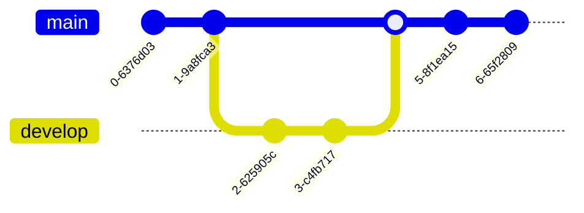

# Mermaid test (Material theme)

## Mermaid usual
This is a test of Mermaid:


> If you don't see a graph here, it's broken.

## Git Graph
This is a test of Git Graph: 




## Normal fences
This is usual fenced code (with no highlighting)

```python
for page in pages:
    page.read()
```

