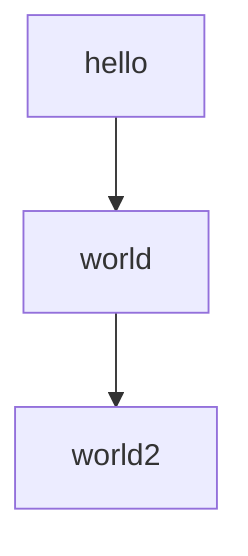
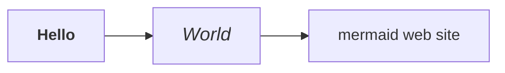

# Mermaid test (medium, with arguments)

## Mermaid usual
This is a test of Mermaid:



> If you don't see a graph here, it's broken.

> The diagram must be **green** (forest).
> If it isn't then arguments in config.yaml are not taken
> into consideration!

## Mermaid (with HTML)

This code exploits the 'loose' security level.

> If you don't see a graph here, it's broken.
> **Hello** should be bold, and *World* should be big and italic.
>
> If you see the tags `<b>` or `<i>`, it's broken.



> The box **mermaid web site** is clickable!


## Normal fences
This is usual fenced code (with color highlighting)

```python
for page in pages:
    page.read()
```

## Javascript callback
Check **in the web console** that a message of that type is displayed:

```
Hello, this is myMermaidCallbackFunction mermaid-1598273751083 14:55:51
```

This is the result of this directive in the config file:

```
extra_javascript:
     - js/extra.js
```