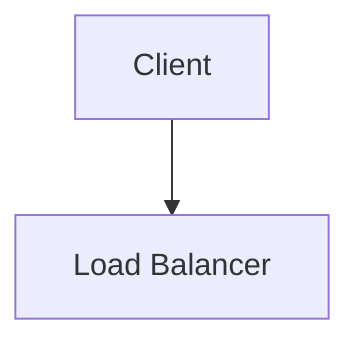
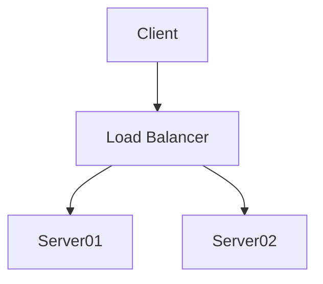

# Second page
Testing special cases

## Wrong diagram

```mermaid
graph FG
A[Client] 
```

> This is version **8.6.4**, 
> because it was explicitly requested in the config file.

## Correct



## Other


