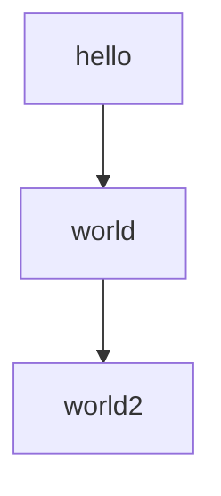

# Mermaid test (simple)

## Mermaid usual
This is a test of Mermaid:



> If you don't see a graph here, it's broken.


## Normal fences
This is usual fenced code (with no highlighting)

```python
for page in pages:
    page.read()
```

