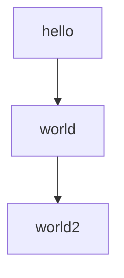

# Mermaid test (SuperFences, custom loader)

!!! Note
    This is a test of the Mermaid plugin, with:

    1. the [pymdownx.superfences extension](https://facelessuser.github.io/pymdown-extensions/extensions/superfences/)
    2. Custom fences with the `mermaid2.fence_mermaid_custom()` formatter
    3. the custom loader is specified as `extra_javascript -> js/loader.js`

## Mermaid (normal)




> If you don't see a graph here, it's broken.

## Mermaid (with HTML)

** This doesn't work! Known bug. **

This code exploits the 'loose' security level.

> If you don't see a graph here, it's broken.
> **Hello** should be bold, and *World* should be big and italic.
>
> If you see the tags `<b>` or `<i>`, it's broken.


## Superfence
This is usual superfenced code, with code highlighting.

> The keyword `for` should be colored in blue.

```python
for page in pages:
    page.read()
```

