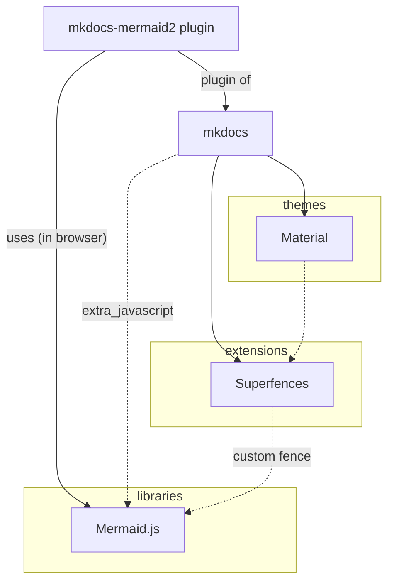

## Guidance

1. Contributions are welcome.
2. Before submitting an issue, consider this documentation, and particularly 
   the [troubleshooting](../troubleshooting) section.
3. Use the [Issues](https://github.com/fralau/mkdocs-mermaid2-plugin/issues) to signal a bug or propose a feature you believe is necessary.
4. If this is a usage question, prefer the [discussions](https://github.com/fralau/mkdocs-mermaid2-plugin/discussions).
5. **Before submitting a PR, always open an Issue and consider the answers.**
6. As a rule, changes get a new version number;
they are first [pushed on github](https://github.com/fralau/mkdocs-mermaid2-plugin), and then [deployed on pypi](https://pypi.org/project/mkdocs-mermaid2-plugin/).

## Making a distinction between the software components
When assessing issues or bugs, it is important to understand which 
components are involved.

## Credits

mkdocs-mermaid2 is a fork from
[Pugong Liu's excellent project](https://github.com/pugong/mkdocs-mermaid-plugin), 
which is no longer maintained. This new plugin offers expanded documentation as
well as new functions.

It is also compatible with versions of the mermaid library > 10.0.

Thanks to all the members of the community who participated to the 
improvement of this project with ideas and PRs.