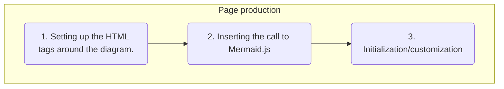

# Detailed description of the page production process

## Steps for the preparation of an HTML page

There are three steps in the preparation of the HTML page:



When the webserver serves the statig html page,
the Mermaid.js library is executed in the user's browser, to render the diagram.

## Conversion to HTML

When converting the markdown into HTML, MkDocs normally inserts the
Mermaid code (text) describing the diagram 
into segments, which will then be processed by the Mermaid.js library
(in the user's browser):

```html
<pre class="mermaid">
<code>
...
</code>
</pre>
```

To make the HTML/css page more robust for most MkDocs themes,
the Mkdocs-Mermaid2 plugin systematically converts
those segments directly into `<div>` elements:

```html
<div class="mermaid">
...
</div>
```

!!! Note "Superfences extension"
    The principle remains the same 
    when using the [Superfences](superfences) extension.

    That extension is **not** mandatory, except
    when using the Material theme.

## Automatic insertion of the Javascript Library
The plugin then inserts a call to the
[javascript library](https://github.com/mermaid-js/mermaid).

By default, the plugin will use one of the latest versions of Mermaid.js.

As already mentioned, you can specify, in the config file, the version
of Mermaid.js required:

```yaml
- mermaid2:
    version: '10.1.0'
```

!!! Note
    Mkdocs-Macros inserts the Mermaid.js library into the HTML page
    **only** when a Mermaid diagram is detected in the markdown page.

!!! Warning "Change of distribution format"
    The behavior of the plugin depends of the version of Mermaid.js.

    [As of version 10 of the Mermaid javascript library, the plugin uses the ESM format for distribution](https://github.com/mermaid-js/mermaid/releases/tag/v10.0.0) (see also the [changelog](https://github.com/mermaid-js/mermaid/blob/develop/CHANGELOG.md#1000)).

    More information can be found on [ECMAScript Module](https://nodejs.org/api/esm.html#modules-ecmascript-modules)
    (or **ESM**), but for our purposes:

    1. **The main file is recognizable because it has the `.mjs` extension.**
    2. The HTML call must have the form: `<script src="<URL>", type="module">`
    3. A module in ESM format is not a single file, but a hierarchy of directories/files.

    **MkDocs-Mermaid2, as of version 1.0, takes this difference into account.**

=== "ESM Library"

    > For versions of MkDocs-Mermaid2 >= 1 and versions of Mermaid2.js >= 10
    
    This requires a specific call from the HTML
    page e.g.:

    ``` html
    <script src="https://unpkg.com/mermaid@10.0.2/dist/mermaid.esm.min.mjs" type="module">
    </script>
    ```

    The plugin automatically inserts this call.

=== "All-in-one Library"

    For an earlier version of the Mermaid.js (<10),
    the plugin continues to use the traditional version, which is an **all-in-one file**.
    
    Those library files are recognizable because they have the `.js` extension.
    
    The call in the HTML page is:

    ``` html
    <script src="https://unpkg.com/mermaid@8.8.2/dist/mermaid.min.js">
    mermaid.initialize()
    </script>
    ```


    The plugin automatically inserts this call.

    ** This is still a valid method.** (Even though the very first versions after 10.0.0 no longer provided
    this file, later versions have resumed providing it.)


## Initialization sequence

### Default sequence
To start displaying of the diagrams, the plugin then automatically inserts 
a separate call to initialize the Mermaid library:

```javascript
mermaid.initialize()
```

The user's browser will then read this code and render it on the fly.

> No svg/png images are produced during the rendering of that graph.

### Additional arguments to the Mermaid engine

Sometimes, however, you may want to add some
additional initialization commands (see [full list](https://github.com/knsv/mermaid/blob/master/docs/mermaidAPI.md#mermaidapi-configuration-defaults)).

For example, you could change the theme of the diagram, 
using 'dark' instead of the default one. 
Simply add those arguments in the config file, e.g.


```yaml
plugins:
- search
- mermaid2:
    version: '10.1.0'
    arguments:
        theme: 'dark'
        themeVariables:
        primaryColor: '#BB2528'
        primaryTextColor: '#fff'
        primaryBorderColor: '#7C0000'
        lineColor: '#F8B229'
        secondaryColor: '#006100'
        tertiaryColor: '#fff'
```

The plugin then automatically adds the initialization sequence:

=== "ESM modules"

    Both `import` and `mermaid.initialize()` must be in the same `<script>`
    tag. This is the code produced by the plugin:

    ```html
    <script type="module">import mermaid from "https://unpkg.com/mermaid@10.1.0/dist/mermaid.esm.min.mjs";
    mermaid.initialize({
        theme: "dark",
        themeVariables: {
            primaryColor: "#BB2528",
            primaryTextColor: "#fff",
            primaryBorderColor: "#7C0000",
            lineColor: "#F8B229",
            secondaryColor: "#006100",
            tertiaryColor: "#fff"
        }
    });
    </script>
    ```
=== "Traditional modules"

    For traditional (all-in-one file) javascript modules, **two** calls to the `<script>` tag are required. This is the code produced by the plugin:

    ```html
    <script src="https://unpkg.com/mermaid@9.1.0/dist/mermaid.min.js"></script>
    <script>mermaid.initialize({
        theme: "dark",
        themeVariables: {
            primaryColor: "#BB2528",
            primaryTextColor: "#fff",
            primaryBorderColor: "#7C0000",
            lineColor: "#F8B229",
            secondaryColor: "#006100",
            tertiaryColor: "#fff"
        }
    });
    </script>
    ```