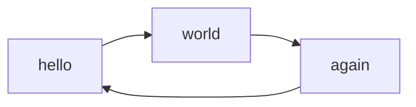
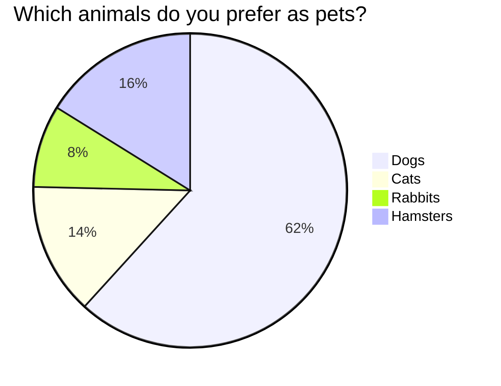
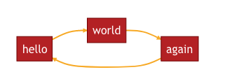
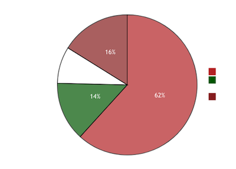

# Mermaid2: A diagrams plugin for Mkdocs

[](https://opensource.org/licenses/MIT) 
[](https://pypi.org/project/mkdocs-mermaid2-plugin/)


## Introduction
**Mermaid2** is a plugin for the [MkDocs](https://www.mkdocs.org/) 
static sites generator, which allows you 
to render Mermaid diagrams inserted in the markdown pages.

- [The official repository of Mermaid2 is on github.](https://github.com/fralau/mkdocs-mermaid2-plugin)
- [Mermaid2 is available from Pypi.](https://pypi.org/project/mkdocs-mermaid2-plugin/)

### What is Mermaid?

[Mermaid](https://mermaid.js.org/intro/) is two things: 

1. A simple language for the creation of diagrams.
2. A [javascript library](https://github.com/mermaid-js/mermaid) (Mermaid.js) 
   for displaying those diagrams in an HTML page.

### General Principle
In order to insert a Mermaid diagram in a markdown page, 

1. Start a new line with a [code fence](https://www.markdownguide.org/extended-syntax/#fenced-code-blocks) (triple backticks),
    with the codeword `mermaid`.
2. Type the diagram using the Mermaid syntax.
2. End with a code fence.


For example, a markdown page containing the following diagram (left-right graph):

    ```mermaid
    graph LR
        hello --> world
        world --> again
        again --> hello
    ```

will then be displayed in the final HTML page as:



The diagram will be rendered on the fly by the web browser,
with the use of the mermaid javascript library. 

The mkdocs-mermaid2 plugin takes care of inserting the javascript library into
the html page and inserting the script to start it.


!!! Note
    You can use all the diagrams types supported by the version of the Mermaid 
    javascript library that you are using (flowchart, class, state, timeline, 
    etc.).


Here is another example:


    ```mermaid
    pie title Which animals do you prefer as pets?
        "Dogs" : 386
        "Cats" : 85
        "Rabbits" : 53
        "Hamsters" : 101
    ```

It will be rendered as (a pie chart):



### How to write Mermaid diagrams

* For instructions on how to make a diagram, see [the official website](https://mermaid.js.org).
* If you are not familiar, see the [Mermaid Overview for Beginners](https://mermaid.js.org/community/n00b-overview.html).
* In case of doubt, you will want to test your diagrams in the [Mermaid Live Editor](https://mermaid.live).


## Installation

### Pre-requisites

* Python 3 >= 3.6
* [Mkdocs](https://www.mkdocs.org/user-guide/installation/)

### Automatic

The most up-to-date, stable production version of mkdocs-mermaid2 is available from the [pypi repository](https://pypi.org/project/mkdocs-mermaid2-plugin/):

```bash
pip install mkdocs-mermaid2-plugin
```

### Manual
The most up-to-date version of the package is available from [github](https://github.com/fralau/mkdocs-mermaid2-plugin).

Clone this repository in a local directory and install the package:

```bash
python setup.py install
```

### Installing and running the test examples
For running the examples the `test` directory, 
you will also need the mkdocs-material theme. You may 
[install it directly](https://squidfunk.github.io/mkdocs-material/getting-started/),
or use the following command to install the whole package:

```bash
pip install mkdocs-mermaid2-plugin[test]
```


## Configuration

### Basic configuration
To enable this plugin, you need to declare it in your [mkdocs config file](https://www.mkdocs.org/user-guide/configuration/)
(`mkdocs.yml`).

In order to work, the plugin also requires the
[mermaid](https://www.npmjs.com/package/mermaid) javascript
library (in the example below, it fetched from the last version
from the [unpkg](https://unpkg.com/) repository; change the version
no as needed).

```yaml
plugins:
    - search
    - mermaid2
```
!!! Warning "Caution"
    If you declare plugins in the config file, you need to declare _all_ of them, 
    including `search` (which would otherwise have been installed by default.)

### Use of the Material theme

!!! Note
    The [Material theme](https://squidfunk.github.io/mkdocs-material/), 
    developed by [squidfunk](https://github.com/squidfunk)
    is not mandatory, but recommended.

    **Mermaid diagrams will automatically adapt their colors to the theme
    and palette.**

Here are the recommended settings in the configuration file:

```yaml
markdown_extensions:
  - pymdownx.superfences:
        # make exceptions to highlighting of code:
      custom_fences:
        - name: mermaid
          class: mermaid
          format: !!python/name:mermaid2.fence_mermaid_custom

```

See the [technical explanation](superfences/#usage-for-the-material-theme).


### Other Themes

If you don't use the Material theme, it will be up to you to define the
theme and colors of the diagrams, by adding arguments to the plugin, e.g. :

```yaml
plugins:
    - search
    - mermaid2:
        version: '9.4.3' # only works with version < 10
        arguments:
          theme: 'dark'
          themeVariables:
            primaryColor: '#BB2528',
            primaryTextColor: '#fff',
            primaryBorderColor: '#7C0000',
            lineColor: '#F8B229',
            secondaryColor: '#006100',
            tertiaryColor: '#fff'
```
The result would be as follows, for the diagrams above:





!!! Warning
    This works currently only with versions of Mermaid.js < 10.


### Specifying the version of the Mermaid library

By default, the plugin selects a version of the Mermaid javascript library
that is known to work (some versions work better than others).

You may specify a different version of the Mermaid library, like so:

```yaml
plugins:
  - search
  - mermaid2:
      version: 10.0.2
```

The plugin will insert the correct call to the javascript library
inside the final HTML page.


### Specifying your own Mermaid library

By default, mkdocs-mermaid2 automatically inserts the proper calls to
Mermaid.js (according to the correct version),
so that the diagrams are correctly interpreted.

You may, however, specify your own call, with the use of the `extra_javascript`
directive in the configuration file. **This is considered as a hack, 
if the default procedure doesn't work.**

If you do that, then the plugin will refrain from inserting its own call 
to the Mermaid.js.

```yaml
extra_javascript:
    - https://unpkg.com/mermaid@8.8.2/dist/mermaid.min.js
```


!!! Warning
    To make this work with versions of the library > 10
    with the `mjs` extension, you need a version of mkdocs > 1.5.0.

    With versions of mkdocs < 1.5.0, 
    see the [troubleshooting section](troubleshooting/#explicit-calls-of-the-mermaid-library).


### Testing

To test your website with a diagram, restart the mkdocs server:

    mkdocs serve

In your browser, open the webpage on the localhost
(by default: `https://localhost:8000`)
