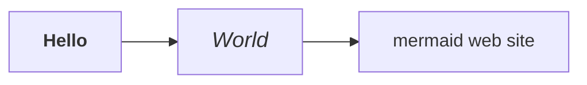

# Tips and Tricks

## Explicit declaration of the Mermaid library

### Introduction
By default, mkdocs-mermaid2 automatically inserts the proper calls to
Mermaid.js (according to the correct version),
so that the diagrams are correctly interpreted.

You may, however, specify your own call, with the use of the `extra_javascript`
directive in the configuration file.

If you do that, then plugin will refrain from inserting its own call 
to the library.

### Version of Mermaid.js < 10

All versions of mkdocs manage correctly the traditional call to javascript
code.


``` html
<script src="https://unpkg.com/mermaid@8.8.2/dist/mermaid.min.js">
</script>
```

You _may_ specify the mermaid library explicitly, as long as it is
call mermaid (independently of extension):

```yaml
extra_javascript:
    - https://unpkg.com/mermaid@8.8.2/dist/mermaid.min.js
```

This will be translated in the final HTML page as:

```html
<script src="https://unpkg.com/mermaid@8.8.2/dist/mermaid.min.js">
```


### Version of Mermaid.js >= 10

Above version 10.0.0 only ESM format libraries are
available](https://github.com/mermaid-js/mermaid/releases/tag/v10.0.0).

This version requires a javascript `import` statement.

  ``` html
  <script type="module">
  import mermaid from "https://unpkg.com/mermaid@10.0.2/dist/mermaid.esm.min.mjs"
  </script>
  ```

=== "mkdocs >= 1.5.0"
    mkdocs correctly recognizes this case and will create the import statement.

    Treat this case normally:

    ```yaml
    extra_javascript:
        - https://unpkg.com/mermaid@8.8.2/dist/mermaid.min.js
    ```
=== "mkdocs < 1.5.0"

    Versions of mkdocs < 1.5.0 call the `<script src=...>` in all cases,
    and this is incorrect.

    As a workaround you could declare a local script file:

    ```yaml
    extra_javascript:
        - js/mermaidloader.js
    ```

    Where `js` is a subdirectory of the document directory (`docs`).

    The file contains the code for the import statement:

    ```javascript
    import mermaid from "https://unpkg.com/mermaid@10.0.2/dist/mermaid.esm.min.mjs"
    ```


!!! Note
    No explicit call to `mermaid.initialize()` is required, since it is
    automatically inserted by the plugin.


!!! Warning

    The "traditional", min.js packages are still unoficially available.
    Even though mkdocs-mermaid2 will not use them,
    you can use them, at your own peril.

    ```yaml
    extra_javascript:
        - https://cdn.jsdelivr.net/npm/mermaid@10.1.0/dist/mermaid.min.js
    ```

    For some reason, they require the `mermaid2.fence_mermaid` function
    in order to work. It means that with the Material theme, 
    your diagrams will not inherit the theme's color
    ([see more information on this subject](../superfences/#usage-for-the-material-theme)).

## Setting the security level to "loose"

To access the following functions, you need to relax mermaid's security level,
([since version 8.2](https://mermaid-js.github.io/mermaid/#/?id=special-note-regarding-version-82)).

!!! Caution 
    This requires you, of course, to take the responsibility 
    for the security of the diagram source.

If that is OK with you, you can set the argument in the configuration of the
plugin:

```yaml
    - mermaid2:
        arguments:
          securityLevel: 'loose'
```

## Formatting text in diagrams

> To enable this function, you need to [relax mermaid's security level to 'loose'](#setting-the-security-level-to-loose).

You may use HTML in the diagram.

!!! Note
    This is guaranteed to work with Mermaid 8.6.4, but
    does not work e.g. on 8.7.0.




Use this in the config file:
```yaml
extra_javascript:
     - https://unpkg.com/mermaid@8.6.4/dist/mermaid.min.js
```


## Adding Hyperlinks to a Diagram 

> To enable this function, you need to [relax mermaid's security level to 'loose'](#setting-the-security-level-to-loose).

=== "Mermaid.js >~ 8.5.0"

    Use the click directive in the language (for more information,
    see [Interaction](https://mermaid-js.github.io/mermaid/#/flowchart?id=interaction) on the official mermaid website).

    ```mermaid
    graph LR
        hello --> world
        world --> mermaid[mermaid web site]
        click mermaid "https://mermaid-js.github.io/mermaid" "Website"
    ```


=== "Mermaid.js < ~ 8.5.0"

    It is possible to add hyperlinks to a  diagram, e.g.:

    ```
    box1[An <b>important</b> <a href="https://google.com">link</a>] 
    ```


## Auto-configure dark mode based on Host OS

Using a combination of the unquote (`^`) functionality of this plugin and the
[prefers-color-scheme](https://developer.mozilla.org/en-US/docs/Web/CSS/@media/prefers-color-scheme)
CSS media feature, one can have the plugin automatically enable dark mode.

```yaml
plugins:
  - search
  - mermaid2:
      arguments:
          theme: |
            ^(window.matchMedia && window.matchMedia('(prefers-color-scheme: dark)').matches) ? 'dark' : 'light'
```

This works well with the `scheme: preference` option in
[mkdocs-material](https://squidfunk.github.io/mkdocs-material/) and referenced in [their documentation](https://squidfunk.github.io/mkdocs-material/setup/changing-the-colors/#color-scheme).


## Material Theme: Switching on the fly between light and dark mode
The Material theme for MkDocs allows [toggling between colors](https://squidfunk.github.io/mkdocs-material/setup/changing-the-colors/#color-palette-toggle).
Unfortunately the Mermaid diagram will not switch out of the box from light to
dark or vice versa. 


This solution is similar to [switch the theme according to the OS color](#auto-configure-dark-mode-based-on-host-os), 
though that earlier, simpler solution cannot toggle dynamically.

A workable solution has been proposed by [elgalu](https://github.com/elgalu)
(for more information see [Issue 39](https://github.com/fralau/mkdocs-mermaid2-plugin/issues/39)).


**`mkdocs.yml`**

(The palette is an example, where primary color, accent, icons, toggle message, etc. can be adapted to your needs.)

```yaml
theme:
  name: material
  # https://squidfunk.github.io/mkdocs-material/setup/changing-the-colors/#color-palette
  palette:
    - media: "(prefers-color-scheme: light)"
      scheme: default
      primary: indigo
      accent: light-blue
      toggle:
        icon: material/toggle-switch-off-outline
        name: Switch to dark mode
    - media: "(prefers-color-scheme: dark)"
      scheme: slate
      primary: black
      accent: deep orange
      toggle:
        icon: material/toggle-switch
        name: Switch to light mode

  # https://facelessuser.github.io/pymdown-extensions/extensions/superfences/
  pymdownx.superfences:
      custom_fences:
        - name: mermaid
          class: mermaid
          format: !!python/name:mermaid2.fence_mermaid

plugins:
  - mermaid2:
      arguments:
        # test if its __palette_1 (dark) or __palette_2 (light)
        # for mkdocs-material >=8.0.0
        theme: |
          ^(JSON.parse(__md_get("__palette").index == 1)) ? 'dark' : 'light'
#       for mkdocs-material <8.0.0
#         ^(JSON.parse(window.localStorage.getItem(__prefix('__palette'))).index == 1) ? 'dark' : 'light'

extra_javascript:
    - extra/refresh_on_toggle_dark_light.js
```

> The caret operator (`^`) means "unquote". It is used here to insert Javascript code into the initialization code of `mermaid.initialize()`.


**`docs/extra/refresh_on_toggle_dark_light.js`**

To avoid refreshing the page after switching between dark/light modes so that Mermaid diagram can be updated, two listeners
must be installed, which are instructed to reload the page, whenever 
they detect a change.

That is the function of the additional script
(`refresh_on_toggle_dark_light.js`):

```javascript
var paletteSwitcher1 = document.getElementById("__palette_1");
var paletteSwitcher2 = document.getElementById("__palette_2");

paletteSwitcher1.addEventListener("change", function () {
  location.reload();
});

paletteSwitcher2.addEventListener("change", function () {
  location.reload();
});
```
