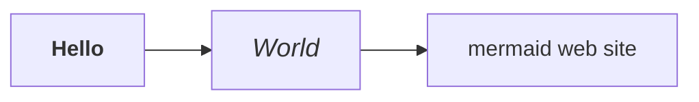
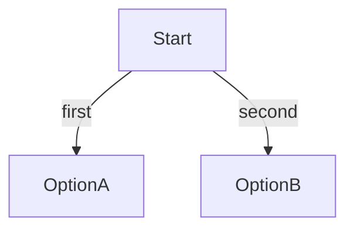

# Tips and Tricks

## Advanced Mermaid Functions

### Setting the security level to "loose"

To access the following functions, you need to relax mermaid's security level,
([since version 8.2](https://mermaid-js.github.io/mermaid/#/?id=special-note-regarding-version-82)).

!!! Caution 
    This requires you, of course, to take the responsibility 
    for the security of the diagram source.

If that is OK with you, you can set the argument in the configuration of the
plugin:

```yaml
    - mermaid2:
        arguments:
          securityLevel: 'loose'
```

### Formatting text in diagrams

> To enable this function, you need to [relax mermaid's security level to 'loose'](#setting-the-security-level-to-loose).

You may use HTML in the diagram.

!!! Caution
    This is guaranteed to work with Mermaid 8.6.4, but
    does not work e.g. on 8.7.0.

    It may not work on more recent versions.


Use HTML formatting:

    ```mermaid
    graph LR
        hello["<b>Hello</b>"] --> world["<big><i>World</i></big>"]
        world --> mermaid[mermaid web site]
    ```



Use this in the config file:
```yaml
extra_javascript:
     - https://unpkg.com/mermaid@8.6.4/dist/mermaid.min.js
```


### Adding Hyperlinks to a Diagram 

> To enable this function, you need to [relax mermaid's security level to 'loose'](#setting-the-security-level-to-loose).

=== "Mermaid.js >~ 8.5.0"

    Use the **click** directive in the language (for more information,
    see [Interaction](https://mermaid-js.github.io/mermaid/#/flowchart?id=interaction) on the official mermaid website).

        ```mermaid
        graph LR
            hello --> world
            world --> mermaid[mermaid web site]
            click mermaid "https://mermaid-js.github.io/mermaid" "Website"
        ```


    ```mermaid
    graph LR
        hello --> world
        world --> mermaid[mermaid web site]
        click mermaid "https://mermaid-js.github.io/mermaid" "Website"
    ```


=== "Mermaid.js < ~ 8.5.0"

    It is possible to add hyperlinks to a  diagram, e.g.:

    ```
    box1[An <b>important</b> <a href="https://google.com">link</a>] 
    ```


## Using variables and macros in diagrams (MkDocs-Macros)


### Variables
What if your diagrams contain a repetitive string, such as the URL of a website
[in your hyperlinks](#adding-hyperlinks-to-a-diagram)?

Instead of writing:

```
graph TD;
    Platform-->Gaming;
    click Gaming "http://127.0.0.1:8000/Gaming/";
```

You might want to use a **variable**:

```
graph TD;
    Platform-->Gaming;
    click Gaming "{{ my_website }}/Gaming/";
```

You define that variable in your project's config file (`mkdocs.yml`):

```yaml
extra:
  my_website: http://127.0.0.1:8000
```


In this way, you will be able to change that value wherever it appears in the pages,
simply by modifying the value in the config file.

To do that, you would have to use the [Mkdocs-Macros plugin](https://mkdocs-macros-plugin.readthedocs.io/).


This requires [installing the plugin](https://mkdocs-macros-plugin.readthedocs.io/en/latest/#standard-installation), and declaring it in the config file.

!!! Caution
    Variables are **not** part of the Mermaid specification. The Macros plugin simply expands the variables in the
    Markdown page, so that the result is a standard Mermaid diagram.


Declare the plugins in the config file, in that order:

```yaml
plugins:
    - search
    - macros
    - mermaid2
```

!!! Tip "Uses of variables"

    You can use an MkDocs-Macros variable to represent _any_ string that you need to repeat
    in Mermaid diagrams, or that could change (over time, or because you have two possible configs).
    
    Variables can be used in any part of a page, inside or outside of Mermaid diagrams.

    MkDocs-Macros and Mkdocs-Mermaid2 are two plugins that work very well together.

    Read the documentation of [MkDocs-Macros](https://mkdocs-macros-plugin.readthedocs.io/), 
    to discover all its possibilities!


### Using macros to generate Mermaid code

If you can program in Python, you could go further than that with MkDocs-Macros:
you could use a Python module (`main.py`) to define
[**macros** (functions)](https://mkdocs-macros-plugin.readthedocs.io/en/latest/macros/)
that produce hyperlinks or pieces of diagrams from data,
or even complete diagrams from a source file.


For example the macro `make_choice()` would create a full diagram from three components.

```python
def define_env(env):


    @env.macro
    def make_choice(start, choice1, choice2):
        """
        Generate a Mermaid decision diagram with two choices from a starting point,
        within a fenced code block.
        """
        lines = [
            "```mermaid",
            "graph TD",
            f"    {start} -->|first| {choice1}",
            f"    {start} -->|second| {choice2}",
            "```"
        ]
        return "\n".join(lines)

```

Then you could write, in your markdown page:

```markdown
{{ make_choice("Start", "OptionA", "OptionB") }}
```

Which would be translated into:

    ```mermaid
    graph TD
        Start -->|first| OptionA
        Start -->|second| OptionB
    ```

And then rendered by your browser as:




## Switching between light and dark mode

### Auto-configure dark mode based on Host OS

Using a combination of the unquote (`^`) functionality of this plugin and the
[prefers-color-scheme](https://developer.mozilla.org/en-US/docs/Web/CSS/@media/prefers-color-scheme)
CSS media feature, one can have the plugin automatically enable dark mode.

```yaml
plugins:
  - search
  - mermaid2:
      arguments:
          theme: |
            ^(window.matchMedia && window.matchMedia('(prefers-color-scheme: dark)').matches) ? 'dark' : 'light'
```

This works well with the `scheme: preference` option in
[mkdocs-material](https://squidfunk.github.io/mkdocs-material/) and referenced in [their documentation](https://squidfunk.github.io/mkdocs-material/setup/changing-the-colors/#color-scheme).


### Material Theme: Switching on the fly between light and dark mode
The Material theme for MkDocs allows [toggling between colors](https://squidfunk.github.io/mkdocs-material/setup/changing-the-colors/#color-palette-toggle).
Unfortunately the Mermaid diagram will not switch out of the box from light to
dark or vice versa. 


This solution is similar to [switch the theme according to the OS color](#auto-configure-dark-mode-based-on-host-os), 
though that earlier, simpler solution cannot toggle dynamically.

A workable solution has been proposed by [elgalu](https://github.com/elgalu)
(for more information see [Issue 39](https://github.com/fralau/mkdocs-mermaid2-plugin/issues/39)).


**`mkdocs.yml`**

(The palette is an example, where primary color, accent, icons, toggle message, etc. can be adapted to your needs.)

```yaml
theme:
  name: material
  # https://squidfunk.github.io/mkdocs-material/setup/changing-the-colors/#color-palette
  palette:
    - media: "(prefers-color-scheme: light)"
      scheme: default
      primary: indigo
      accent: light-blue
      toggle:
        icon: material/toggle-switch-off-outline
        name: Switch to dark mode
    - media: "(prefers-color-scheme: dark)"
      scheme: slate
      primary: black
      accent: deep orange
      toggle:
        icon: material/toggle-switch
        name: Switch to light mode

  # https://facelessuser.github.io/pymdown-extensions/extensions/superfences/
  pymdownx.superfences:
      custom_fences:
        - name: mermaid
          class: mermaid
          format: !!python/name:mermaid2.fence_mermaid

plugins:
  - mermaid2:
      arguments:
        # test if its __palette_1 (dark) or __palette_2 (light)
        # for mkdocs-material >=8.0.0
        theme: |
          ^(JSON.parse(__md_get("__palette").index == 1)) ? 'dark' : 'light'
#       for mkdocs-material <8.0.0
#         ^(JSON.parse(window.localStorage.getItem(__prefix('__palette'))).index == 1) ? 'dark' : 'light'

extra_javascript:
    - extra/refresh_on_toggle_dark_light.js
```

> The caret operator (`^`) means "unquote". It is used here to insert Javascript code into the initialization code of `mermaid.initialize()`.


**`docs/extra/refresh_on_toggle_dark_light.js`**

To avoid refreshing the page after switching between dark/light modes so that Mermaid diagram can be updated, two listeners
must be installed, which are instructed to reload the page, whenever 
they detect a change.

That is the function of the additional script
(`refresh_on_toggle_dark_light.js`):

```javascript
var paletteSwitcher1 = document.getElementById("__palette_1");
var paletteSwitcher2 = document.getElementById("__palette_2");

paletteSwitcher1.addEventListener("change", function () {
  location.reload();
});

paletteSwitcher2.addEventListener("change", function () {
  location.reload();
});
```
