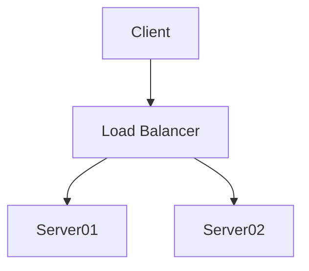

## Important notice

If mermaid diagrams are not displayed correctly, or not displayed at all
**read this section first**!


## Mermaid diagram is not displayed (or displayed incorrectly)

!!! Tip
    To start with, use a simple diagram that you know is syntactically correct.

e.g.

    ```mermaid
    graph TD
    A[Client] --> B[Load Balancer]
    B --> C[Server01]
    B --> D[Server02]
    ```



!!! Notes
    1. Every diagram should start with a valid preamble, e.g. `graph TD`.
    2. In case of doubt, you may want to test your diagram in the
       [Mermaid Live Editor](https://mermaid-js.github.io/mermaid-live-editor)
    3. Note, however, that the Mermaid Live Editor **does not
       support loose mode** (with HTML code in the mermaid code).

### Seeing an error message at the place of the diagram?

In recent versions of the javascript library (> 8.6.0), a pretty
error message is displayed in case of incorrect syntax:


!!! Note
    In earlier versions, the library displayed nothing, which 
    could be confusing.

If you see the error message, it is at least an indication that 
the mermaid javascript library was called.

### The mermaid source code appears as-is (not read)?
In that case, the javascript library was probably not called.

!!! Tip
    **Examine the HTML code produced in the page and see the next questions.**


### Using superfences, but no diagram is displayed?

If you are using the superfences extension, but you see the source
code, you probably forgot to declare the custom_fences, or declared the wrong
one. 
Se more explanations under [Declaring the superfences extension](superfences#specifying-the-mermaid-custom-fence)

!!! Tip
    **Examine the HTML code produced in the page and see the next questions.**

### Is mkdocs' version up to date (>= 1.1) ?


!!! Note
    As an absolute minimum, you should use a version of mkdocs > 1.1. 

    A version >= 1.5 is recommended.

To determine the version, use `mkdocs -V`.

To update mkdocs:

    pip install mkdocs --upgrade

Or, if you cloned the repo:

    python setup.py install


### Is the javascript library properly called?

In order to work, the proper javascript library must called from
the html page (by default, the call is inserted automatically).

Control the link used in the HTML page generated, e.g.:

```HTML
<script type="module">import mermaid from "https://unpkg.com/mermaid@10.0.2/dist/mermaid.esm.min.mjs"</script>
```


### A certain type of diagram (e.g. mindmap, etc.) is not displayed, or the syntax is incorrectly interpreted?

Check the version of the javascript mermaid library you are using (it's indicated
in the error message; as a last resort, check in the html page). 
You can [change the library version if needed](../#specifying-the-version-of-the-mermaid-library).

### What if nothing worked?

1. Check the [test cases](https://github.com/fralau/mkdocs-mermaid2-plugin/tree/1ab72b5c6a5acf35cc702b7d85019b08678a52e2/test) on the github repository
    and try to run them on your machine;
    start with the `simple` website.
2. Open a question on the [discussion page for the project](https://github.com/fralau/mkdocs-mermaid2-plugin/discussions).


## Explicit calls of the Mermaid library

!!! Warning "Important"
    If you [specify the version number in the config file](/#specifying-the-version-of-the-mermaid-library), then
    the mkdocs-mermaid2 will insert the correct calls for you.

    Remember that explicit calls to the Mermaid.js
    (through `extra_javascript` in the config file) are **optional**
    and are considered a **hack** if the default procedure doesn't work.


### Issues with versions
**Mermaid.js**: Above version 10.0.0, [the official format for the Mermaid library is ESM](https://github.com/mermaid-js/mermaid/releases/tag/v10.0.0).

**MkDocs**: Under version 1.5.0, the `extra_javascript` directive in the config
file (`mkdocs.yml`) does not process ESM libraries correctly.


### Version of Mermaid.js < 10

All versions of mkdocs manage correctly the traditional call to javascript
code.


``` html
<script src="https://unpkg.com/mermaid@8.8.2/dist/mermaid.min.js">
</script>
```

You _may_ specify the mermaid library explicitly in the config file,
as long as it is call mermaid (independently of extension):

```yaml
extra_javascript:
    - https://unpkg.com/mermaid@8.8.2/dist/mermaid.min.js
```

This will be translated in the final HTML page as:

```html
<script src="https://unpkg.com/mermaid@8.8.2/dist/mermaid.min.js">
```


### Version of Mermaid.js >= 10

As an ESM javascript library, Mermaid.js requires an `import` statement.

  ``` html
  <script type="module">
  import mermaid from "https://unpkg.com/mermaid@10.0.2/dist/mermaid.esm.min.mjs"
  </script>
  ```

=== "MkDocs < 1.5.0"

    Versions of MkDocs < 1.5.0 translate the call into `<script src=...>`
    in all cases, and this is incorrect.

    **Upgrade to MkDocs >= 1.5.0 and this should fix the problem!**

    Otherwise, as a workaround you could declare a local script file:

    ```yaml
    extra_javascript:
        - js/mermaidloader.js
    ```

    Where `js` is a subdirectory of the document directory (`docs`).

    The file contains the code for the import statement:

    ```javascript
    import mermaid from "https://unpkg.com/mermaid@10.0.2/dist/mermaid.esm.min.mjs"
    ```


=== "MkDocs >= 1.5.0"
    MkDocs correctly recognizes this case and will create the import statement.

    **Treat this case normally.**

    ```yaml
    extra_javascript:
        - https://unpkg.com/mermaid@10.0.2/dist/mermaid.esm.min.mjs
    ```


!!! Warning

    The "traditional", min.js packages are still unoficially available.
    Even though mkdocs-mermaid2 will not insert them by default,
    you can use them, at your own peril.

    ```yaml
    extra_javascript:
        - https://cdn.jsdelivr.net/npm/mermaid@10.1.0/dist/mermaid.min.js
    ```

    For some reason, they require the `mermaid2.fence_mermaid` function
    in order to work. It means that with the Material theme, 
    your diagrams will not inherit the theme's color
    ([see more information on this subject](../superfences/#usage-for-the-material-theme)).


## Other issues

### Rich text diagrams, or links are not displayed properly?

1. As a first step, [set the security level to 'loose'](../tips/#setting-the-security-level-to-loose).
2. Make sure you use a compatible version of the javascript library
   (8.6.4, 8.8.0, ~~8.7.0~~). In principle, the version used
   by the plugin is compatible (see instructions to 
   [change the version](../#specifying-the-version-of-the-mermaid-library)).


### With pymdownx.details, diagrams in collapsed elements are not displayed?

**This fix is experimental (it has been tested once and it worked).**

If you declared `pymdownx.details` in `config.yml` 
(under `markdown_extensions`), you may notice that a diagram will not
display correctly in that case:

```markdown
???- note "Collapsed"
    ```mermaid
    graph TD
    A[Client] --> B[Load Balancer]
    ```
    This is additional text.
```

Depending on the browser, you may have a dot, or nothing, etc.


In that case, use the following declaration in your `markdown_extensions`:
```yaml
  - pymdownx.superfences:
      # make exceptions to highlighting of code:
      custom_fences:
        - name: mermaid
          class: mermaid
          format: !!python/name:mermaid2.fence_mermaid_custom
```

The use of this function will trigger a custom behavior, with two effects:

1. It will create custom HTML tags, `<pre class='mermaid'><code>`.
2. It will deactivate the auto-load.

You **must** then use a special custom javascript loader for the diagram,
developed by [facelessuser](https://github.com/facelessuser): 

1. Copy the code from
the [website of PyMdown Extension](https://facelessuser.github.io/pymdown-extensions/extras/mermaid/#putting-it-all-together).
2. Paste it in a file in your project: `docs/js/loader.js`
3. Declare this script in the `config.yml` file:

```yaml
extra_javascript:
     - js/loader.js
```


## Using the mermaid2.dumps() function

As a bonus, mkdocs-mermaid2 exports the Python function `dumps()` 
which produces a string
describing a [JavaScript object](https://javascript.info/object).
It can be used to help generate JavaScript code from Python
(this is typically needed, when generating an HTML page that contains
JavaScript).

A JavaScript object is not exactly the same as a JSON object.
The reason why this why introduced is that sometimes one needs to produce
a key/value pair as:

```JavaScript
foo = MyFunctioName
```

where the value is _not_ a string but an identifier (in this case:
a function name).

Here is an example:

```python
import mermaid2

obj = { "hello": "world", 
    "barbaz": "^bazbar",
    "foo": {"bar": 2},
    "bar": True}

s = mermaid2.dumps(obj)

```

The purpose of the caret is to specify that the value should be
an identifier and not a string. The result will be:

```JavasScript
{
    hello: "world",
    barbaz: bazbar,
    foo: {
        bar: 2
    },
    bar: true
}
```